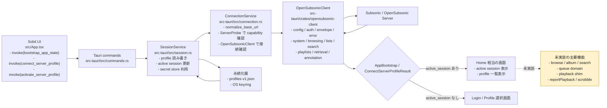
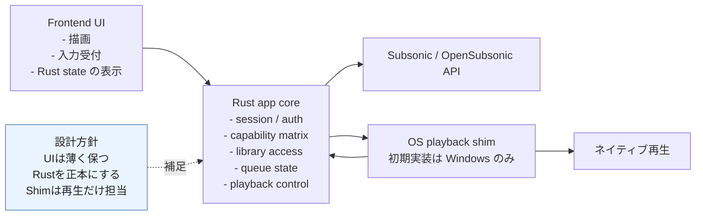
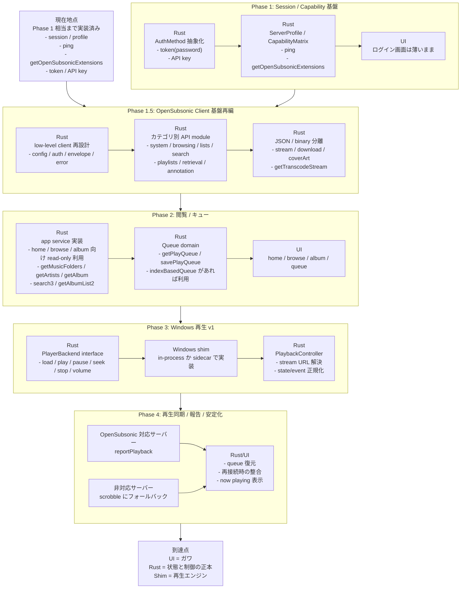

# 実装フロー図

このファイルは、2026-03-23 時点の実装状態に基づく現状フローと、今後の実装を進めるための Phase フローを Mermaid でまとめたものです。

## 1. 現状のフロー

## 2. 完成イメージの責務分離

## 3. Phase で進める提案フロー

## 4. Phase 1.5 の補足

- Phase 1.5 は、UI 機能追加の前に OpenSubsonic の低レベル通信レイヤーを作り直すためのフェーズです。
- このフェーズでは `docs/OpenSubSonic/docs` 配下の endpoint を、カテゴリ別の low-level wrapper として先に実装してよいです。
- ただし「low-level wrapper の実装完了」と「画面でその API を使う app service の実装」は分けて考えます。
- そのため Phase 2 の `read-only API 実装` は、全 endpoint の Rust 化そのものではなく、画面に必要な読み取り系 API を使う上位機能の実装を指すものとして整理します。
