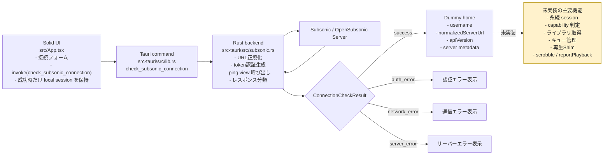
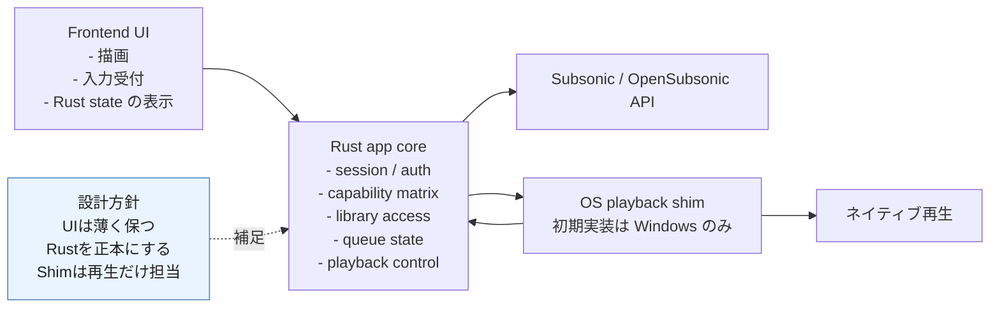
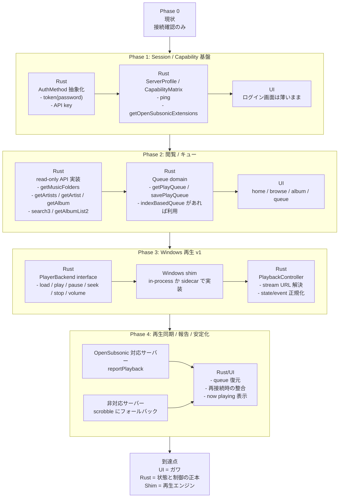

# 実装フロー図

このファイルは、2026-03-23 時点の実装状態に基づく現状フローと、今後の実装を進めるための Phase フローを Mermaid でまとめたものです。

## 1. 現状のフロー

```mermaid
flowchart LR
  UI["Solid UI<br/>src/App.tsx<br/>- 接続フォーム<br/>- invoke(check_subsonic_connection)<br/>- 成功時だけ local session を保持"] --> CMD["Tauri command<br/>src-tauri/src/lib.rs<br/>check_subsonic_connection"]
  CMD --> RUST["Rust backend<br/>src-tauri/src/subsonic.rs<br/>- URL正規化<br/>- token認証生成<br/>- ping.view 呼び出し<br/>- レスポンス分類"]
  RUST --> SERVER["Subsonic / OpenSubsonic Server"]
  SERVER --> RUST
  RUST --> RESULT{"ConnectionCheckResult"}
  RESULT -->|success| HOME["Dummy home<br/>- username<br/>- normalizedServerUrl<br/>- apiVersion<br/>- server metadata"]
  RESULT -->|auth_error| AUTH["認証エラー表示"]
  RESULT -->|network_error| NET["通信エラー表示"]
  RESULT -->|server_error| SRV["サーバーエラー表示"]

  HOME -. 未実装 .-> TODO["未実装の主要機能<br/>- 永続 session<br/>- capability 判定<br/>- ライブラリ取得<br/>- キュー管理<br/>- 再生Shim<br/>- scrobble / reportPlayback"]

  classDef warn fill:#fff2cc,stroke:#b38f00,color:#222;
  class TODO warn;
```

## 2. 完成イメージの責務分離

```mermaid
flowchart LR
  UI["Frontend UI<br/>- 描画<br/>- 入力受付<br/>- Rust state の表示"] --> CORE["Rust app core<br/>- session / auth<br/>- capability matrix<br/>- library access<br/>- queue state<br/>- playback control"]
  CORE --> API["Subsonic / OpenSubsonic API"]
  CORE --> SHIM["OS playback shim<br/>初期実装は Windows のみ"]
  SHIM --> AUDIO["ネイティブ再生"]
  SHIM --> CORE

  NOTE["設計方針<br/>UIは薄く保つ<br/>Rustを正本にする<br/>Shimは再生だけ担当"]:::note
  NOTE -. 補足 .-> CORE

  classDef note fill:#e9f4ff,stroke:#4a7eb8,color:#222;
```

## 3. Phase で進める提案フロー

```mermaid
flowchart TB
  NOW["Phase 0<br/>現状<br/>接続確認のみ"] --> P1

  subgraph P1["Phase 1: Session / Capability 基盤"]
    P1A["Rust<br/>AuthMethod 抽象化<br/>- token(password)<br/>- API key"]
    P1B["Rust<br/>ServerProfile / CapabilityMatrix<br/>- ping<br/>- getOpenSubsonicExtensions"]
    P1C["UI<br/>ログイン画面は薄いまま"]
    P1A --> P1B --> P1C
  end

  P1 --> P2

  subgraph P2["Phase 2: 閲覧 / キュー"]
    P2A["Rust<br/>read-only API 実装<br/>- getMusicFolders<br/>- getArtists / getArtist / getAlbum<br/>- search3 / getAlbumList2"]
    P2B["Rust<br/>Queue domain<br/>- getPlayQueue / savePlayQueue<br/>- indexBasedQueue があれば利用"]
    P2C["UI<br/>home / browse / album / queue"]
    P2A --> P2B --> P2C
  end

  P2 --> P3

  subgraph P3["Phase 3: Windows 再生 v1"]
    P3A["Rust<br/>PlayerBackend interface<br/>- load / play / pause / seek / stop / volume"]
    P3B["Windows shim<br/>in-process か sidecar で実装"]
    P3C["Rust<br/>PlaybackController<br/>- stream URL 解決<br/>- state/event 正規化"]
    P3A --> P3B --> P3C
  end

  P3 --> P4

  subgraph P4["Phase 4: 再生同期 / 報告 / 安定化"]
    P4A["OpenSubsonic 対応サーバー<br/>reportPlayback"]
    P4B["非対応サーバー<br/>scrobble にフォールバック"]
    P4C["Rust/UI<br/>- queue 復元<br/>- 再接続時の整合<br/>- now playing 表示"]
    P4A --> P4C
    P4B --> P4C
  end

  P4 --> GOAL["到達点<br/>UI = ガワ<br/>Rust = 状態と制御の正本<br/>Shim = 再生エンジン"]
```
